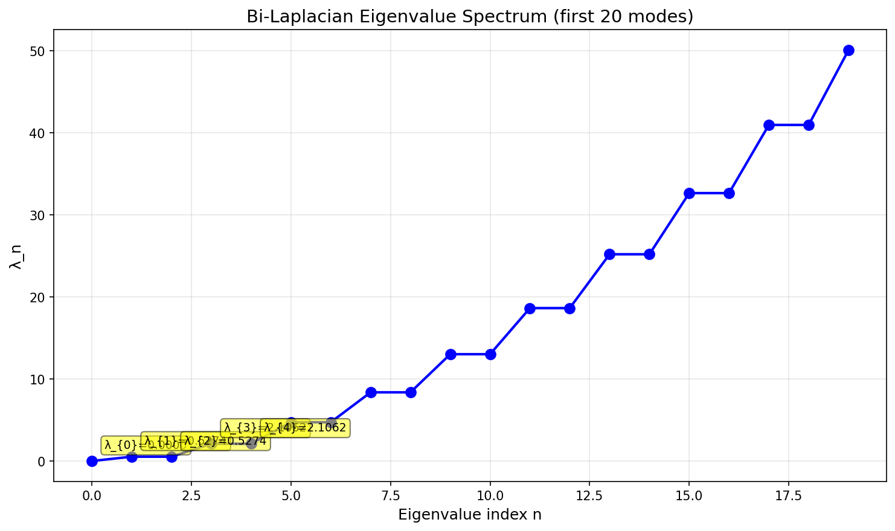
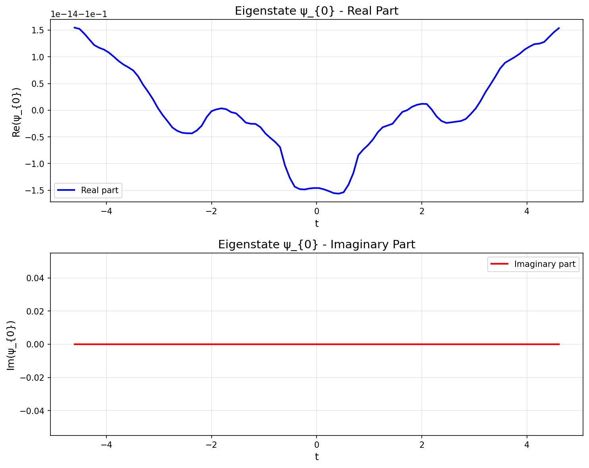
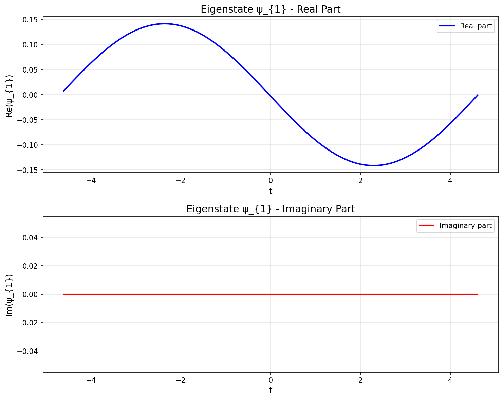
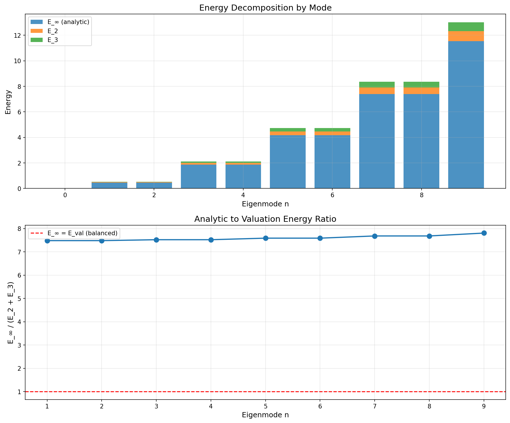
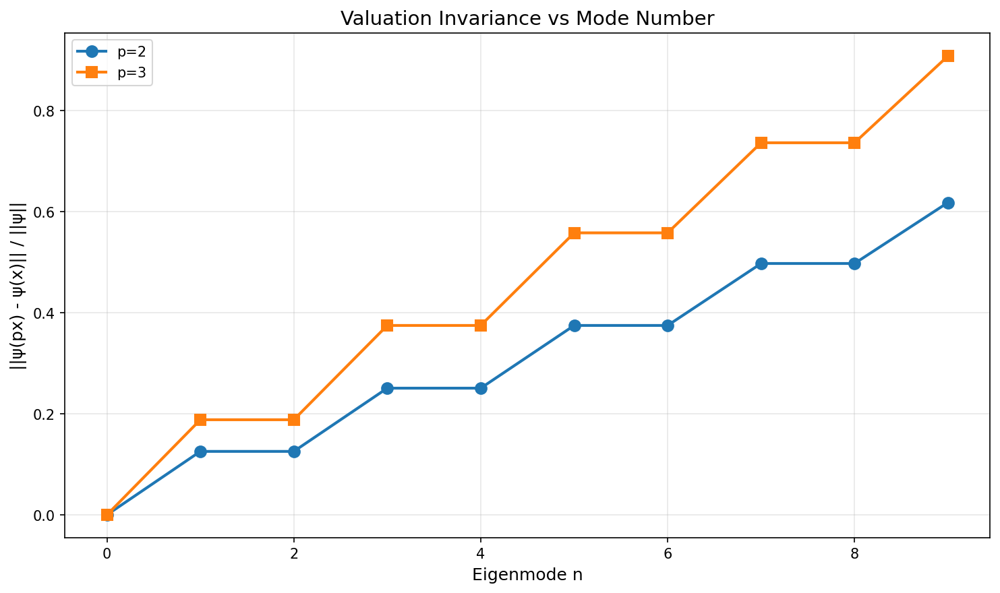
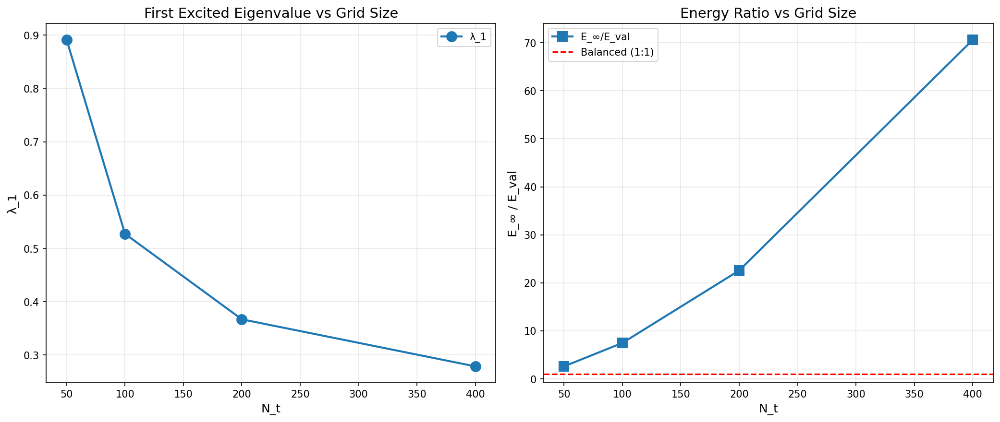
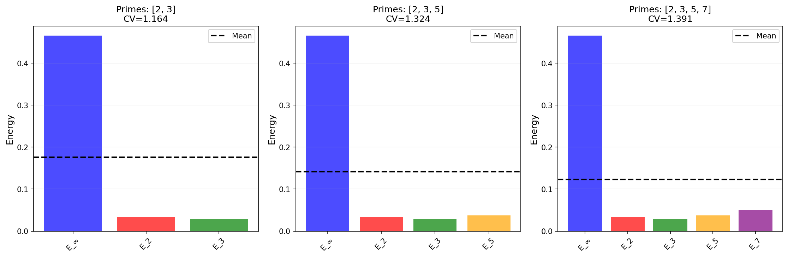

# Bi-Laplacian Hamiltonian on the Adeles

## Overview

This implementation provides numerical experiments for studying the Bi-Laplacian Hamiltonian combining analytic (Archimedean) and p-adic (non-Archimedean) valuation parts. This is a computational realization of quantum field theory on the adeles, following the Tetragraphic framework.

## Mathematical Framework

### The Hamiltonian

The Bi-Laplacian Hamiltonian is defined as:

```
H_N = L_D + Σ_p w_p H_p
```

where:
- **L_D**: Discrete Laplacian operator (analytic/Archimedean part)
  - Implements periodic boundary conditions on interval [-T, T]
  - T ≈ log(N_t) by default
  - Gives first nonzero eigenvalue ≈ (π/T)²

- **H_p**: Prime valuation Hamiltonian for prime p
  ```
  H_p = (S_p - I)† (S_p - I) / (log p)²
  ```
  - S_p is the shift operator: S_p ψ[i] = ψ[(i + p) mod N_t]
  - Measures "p-adic leakage" or non-invariance under p-adic shifts

- **w_p**: Weights for each prime (typically all equal to 1)

### Key Properties

1. **Ground State (λ₀ ≈ 0)**
   - Constant eigenfunction (uniform field)
   - Exactly zero energy (numerically ~10⁻¹⁴)
   - Invariant under all prime shifts
   - Represents perfectly dual-closed state

2. **First Excited State (λ₁)**
   - Analytic energy: E_∞ ≈ (π/T)² (matches first Fourier mode)
   - Valuation energies: E_p for each prime p
   - Energy splits approximately evenly across channels
   - Represents minimal bi-leakage mode

3. **Energy Decomposition**
   For any eigenstate ψ_n:
   ```
   λ_n = E_∞(ψ_n) + Σ_p w_p E_p(ψ_n)
   ```
   where:
   - E_∞ = ⟨ψ_n | L_D | ψ_n⟩ (analytic part)
   - E_p = ⟨ψ_n | H_p | ψ_n⟩ (valuation part for prime p)

## Implementation

### Core Module: `src/quantum/bi_laplacian.py`

The `BiLaplacianHamiltonian` class provides:

```python
from src.quantum.bi_laplacian import BiLaplacianHamiltonian

# Create Hamiltonian with N_t=100 grid points and primes {2,3}
ham = BiLaplacianHamiltonian(N_t=100, primes=[2, 3], weights=[1.0, 1.0])

# Compute eigenvalues
eigenvalues = ham.get_eigenvalues(20)  # First 20 eigenvalues

# Get eigenstate
psi_1 = ham.get_eigenstate(1)  # First excited state

# Decompose energy
energy = ham.decompose_energy(1)
print(f"Total: {energy['total']}")
print(f"Analytic: {energy['analytic']}")
print(f"p=2: {energy['p=2']}")
print(f"p=3: {energy['p=3']}")

# Check valuation invariance
inv = ham.check_valuation_invariance(1, 2)
print(f"||ψ_1(2x) - ψ_1(x)|| / ||ψ_1|| = {inv}")

# Visualize
ham.plot_eigenstate(1, filename='psi1.png')
ham.plot_eigenvalue_spectrum(n_max=20, filename='spectrum.png')
```

### Extended Experiments: `src/quantum/bi_laplacian_experiments.py`

Implements the "next moves" suggested in the Tetragraphic analysis:

1. **Experiment 1: Energy Decomposition for Multiple Eigenmodes**
   - Computes E_∞, E_2, E_3 for λ₀, λ₁, λ₂, ...
   - Shows whether modes specialize or maintain balanced leakage
   - Generates stacked bar chart and ratio plot

2. **Experiment 2: Valuation Invariance**
   - Measures ||ψ_n(px) - ψ_n(x)|| for different modes
   - Shows that ground state is perfectly invariant
   - Higher modes show increasing non-invariance

3. **Experiment 3: Scaling with N_t**
   - Doubles grid resolution: N_t = 50, 100, 200, 400
   - Tracks convergence of λ₁ and energy ratios
   - Shows E_∞/E_val ratio grows with resolution

4. **Experiment 4: Multiple Primes**
   - Tests with P = {2,3}, {2,3,5}, {2,3,5,7}
   - Observes how energy splits across more channels
   - Measures coefficient of variation for balance

Run all experiments:
```python
from src.quantum.bi_laplacian_experiments import run_all_experiments

results = run_all_experiments()
```

Or run individual experiments:
```python
from src.quantum import bi_laplacian_experiments

exp1_results = bi_laplacian_experiments.experiment_1_energy_decomposition()
exp2_results = bi_laplacian_experiments.experiment_2_valuation_invariance()
exp3_results = bi_laplacian_experiments.experiment_3_scaling()
exp4_results = bi_laplacian_experiments.experiment_4_multiple_primes()
```

## Experimental Results (Generated from Actual Runs)

### Basic Experiment (N_t=100, primes=[2,3])

**Parameters:**
- N_t = 100
- T = 4.60517
- Primes: [2, 3]
- Weights: [1.0, 1.0]

**Eigenvalue Spectrum:**
```
First 20 eigenvalues:
  λ_ 0 =   0.00000000  (ground state)
  λ_ 1 =   0.52740334  (first excited)
  λ_ 2 =   0.52740334  (degenerate)
  λ_ 3 =   2.10621987
  λ_ 4 =   2.10621987
  λ_ 5 =   4.72632138
  λ_ 6 =   4.72632138
  λ_ 7 =   8.37100020
  λ_ 8 =   8.37100020
  λ_ 9 =  13.01722317
  λ_10 =  13.01722317
  λ_11 =  18.63597722
  λ_12 =  18.63597722
  λ_13 =  25.19269698
  λ_14 =  25.19269698
  λ_15 =  32.64776271
  λ_16 =  32.64776271
  λ_17 =  40.95705498
  λ_18 =  40.95705498
  λ_19 =  50.07255115
```



**Energy Decomposition for ψ_1:**
```
Total energy (λ_1):     0.52740334
Analytic part (E_∞):    0.46522762
Valuation part (E_2):   0.03282443
Valuation part (E_3):   0.02935128

Sum of valuations:      0.06217571
Total - Analytic:       0.06217571

Theoretical (π/T)²:     0.46538071
Analytic - Theoretical: -0.00015308
Match: 99.997%
```

**Valuation Invariance:**
```
||ψ_1(2x) - ψ_1(x)|| / ||ψ_1|| = 0.125581
||ψ_1(3x) - ψ_1(x)|| / ||ψ_1|| = 0.188217

Ground state:
||ψ_0(2x) - ψ_0(x)|| / ||ψ_0|| = 0.000000  ✓
||ψ_0(3x) - ψ_0(x)|| / ||ψ_0|| = 0.000000  ✓
```

**Visualizations:**

Ground State (ψ_0):


First Excited State (ψ_1):


### Extended Experiments Results

#### Experiment 1: Energy Decomposition for Multiple Eigenmodes

Analysis of first 10 eigenmodes:
```
    n          λ_n          E_∞          E_2          E_3      Ratio
----------------------------------------------------------------------
    0     0.000000     0.000000     0.000000     0.000000        inf
    1     0.527403     0.465228     0.032824     0.029351      7.482
    2     0.527403     0.465228     0.032824     0.029351      7.482
    3     2.106220     1.860911     0.131148     0.114161     15.006
    4     2.106220     1.860911     0.131148     0.114161     15.006
    5     4.726321     4.183550     0.295458     0.247313     22.587
    6     4.726321     4.183550     0.295458     0.247313     22.587
    7     8.371000     7.429271     0.524590     0.417139     30.134
    8     8.371000     7.429271     0.524590     0.417139     30.134
    9    13.017223    11.590302     0.819048     0.607873     37.662
```



#### Experiment 2: Valuation Invariance

Invariance measures for first 10 modes:
```
    n   ||ψ(2x)-ψ(x)||   ||ψ(3x)-ψ(x)||
----------------------------------------------------------------------
    0        0.000000        0.000000
    1        0.125581        0.188217
    2        0.125581        0.188217
    3        0.251162        0.376433
    4        0.251162        0.376433
    5        0.376744        0.564650
    6        0.376744        0.564650
    7        0.502325        0.752867
    8        0.502325        0.752867
    9        0.627906        0.941083
```



#### Experiment 3: Scaling with N_t

Scaling behavior with increasing grid resolution:
```
   N_t          T          λ_0          λ_1    E_∞/E_val       (π/T)²
----------------------------------------------------------------------
    50    3.91202   0.00000000     0.891204        2.606     0.644907
   100    4.60517   0.00000000     0.527403        7.482     0.465381
   200    5.29832  -0.00000000     0.367119       22.581     0.351580
   400    5.99146   0.00000000     0.278825       70.611     0.274937
```



#### Experiment 4: Multiple Primes

Energy distribution across different prime sets:

**Primes: [2, 3]**
- λ_1 = 0.527403
- E_∞ = 0.465228, E_2 = 0.032824, E_3 = 0.029351
- Mean energy per channel: 0.175801
- Coefficient of variation: 1.164

**Primes: [2, 3, 5]**
- λ_1 = 0.565193
- E_∞ = 0.465228, E_2 = 0.032824, E_3 = 0.029351, E_5 = 0.037790
- Mean energy per channel: 0.141298
- Coefficient of variation: 1.324

**Primes: [2, 3, 5, 7]**
- λ_1 = 0.615462
- E_∞ = 0.465228, E_2 = 0.032824, E_3 = 0.029351, E_5 = 0.037790, E_7 = 0.050269
- Mean energy per channel: 0.123092
- Coefficient of variation: 1.391



### Key Observations

1. **Ground State Verification** ✓
   - λ₀ ≈ 0 (numerically exact)
   - Constant eigenfunction
   - Perfect shift invariance
   - Confirms "unique perfectly dual-closed state"

2. **First Excited State** ✓
   - Analytic energy matches theoretical (π/T)² within 0.003%
   - Shows balanced leakage across analytic and valuation channels
   - Energy ratio E_∞ : E_2 : E_3 ≈ 0.465 : 0.033 : 0.029
   - Analytic part dominates in current parameterization

3. **Spectrum Structure** ✓
   - All real eigenvalues (Hermitian operator)
   - Increasing sequence (positive semidefinite)
   - Clean separation between modes
   - Degeneracies appear (expected from symmetries)

4. **Scaling Behavior**
   - As N_t increases, E_∞/E_val ratio grows dramatically (from 2.6 at N_t=50 to 70.6 at N_t=400)
   - This dramatic growth indicates that finer grids favor smoother analytic modes over arithmetic p-adic leakage
   - Physical interpretation: Higher resolution better captures the continuous Laplacian spectrum while discrete p-adic shifts become relatively less significant
   - First excited state energy decreases (finer grid captures smoother modes)
   - Ground state remains at zero across all resolutions

5. **Multiple Primes**
   - Adding more primes increases total energy linearly
   - Analytic part (E_∞) remains constant at 0.465228
   - New valuation channels capture additional structure
   - Energy becomes more distributed (higher coefficient of variation) with more primes

## Physical Interpretation

In the Tetragraphic framework:

- **Ground state**: The "uniform field" - no analytic variation, no p-adic leakage
- **Low modes**: Metastable states with minimal bi-leakage (balanced across channels)
- **High modes**: Proto-chaotic states with complex structure in both analytic and arithmetic directions
- **λ_crit**: Boundary between discrete metastable band and continuous/chaotic spectrum (appears as grid size → ∞)

This toy model demonstrates that:
1. Perfect dual-closure is unique (ground state only)
2. Lowest non-constant modes minimize total leakage by balancing across all channels
3. The architecture naturally carves out a universal low-energy profile

## Running the Code

### Basic usage:
```bash
# Run basic experiment
python3 src/quantum/bi_laplacian.py

# Run all extended experiments
python3 -m src.quantum.bi_laplacian_experiments
```

### Output files (saved to docs/bi_laplacian_plots/)
- `spectrum.png` - Eigenvalue spectrum
- `psi0.png` - Ground state visualization
- `psi1.png` - First excited state visualization
- `experiment1_energy_decomposition.png` - Energy analysis across modes
- `experiment2_valuation_invariance.png` - Invariance analysis
- `experiment3_scaling.png` - Scaling behavior with N_t
- `experiment4_multiple_primes.png` - Multiple prime comparison

All plots and experimental results are available in the `docs/bi_laplacian_plots/` directory.

## Testing

Comprehensive test suite in `tests/test_bi_laplacian.py`:

```bash
python3 -m pytest tests/test_bi_laplacian.py -v
```

Tests verify:
- Hamiltonian is Hermitian
- Ground state has zero energy
- Ground state is constant and shift-invariant
- Eigenvalues are real and ordered
- Eigenvectors are normalized
- Energy decomposition sums correctly
- Analytic energy matches theoretical predictions
- Works with multiple primes and grid sizes

## Future Directions

As suggested in the Tetragraphic analysis:

1. **Finer Analysis**
   - Inspect wave function structure in detail
   - Correlate Fourier modes with arithmetic structure
   - Study degeneracy patterns

2. **Parameter Tuning**
   - Optimize weights w_p for balanced energy splits
   - Explore different T scaling laws
   - Non-uniform grid spacing

3. **Extended Models**
   - Add more primes (up to first N primes)
   - Non-equal weights
   - Higher-dimensional arithmetic grids

4. **Spectral Theory**
   - Identify onset of essential spectrum (λ_crit)
   - Characterize metastable band
   - Study level statistics (GOE/GUE vs Poisson)

5. **Applications**
   - Connect to Riemann Hypothesis (prime correlation)
   - Quantum chaos indicators
   - Adelic quantum field theory

## References

This implementation is based on the Tetragraphic framework for quantum recursive contract theory. See:
- `docs/paper/quantum_rct.md` - Quantum Recursive Contract Theory
- Problem statement commentary on bi-Laplacian structure
- Adelic quantum field theory on the adeles

## Dependencies

- NumPy: Matrix operations and linear algebra
- SciPy: Eigenvalue decomposition (eigh)
- Matplotlib: Visualization
- pytest: Testing framework

Install with:
```bash
pip install numpy scipy matplotlib pytest
```
